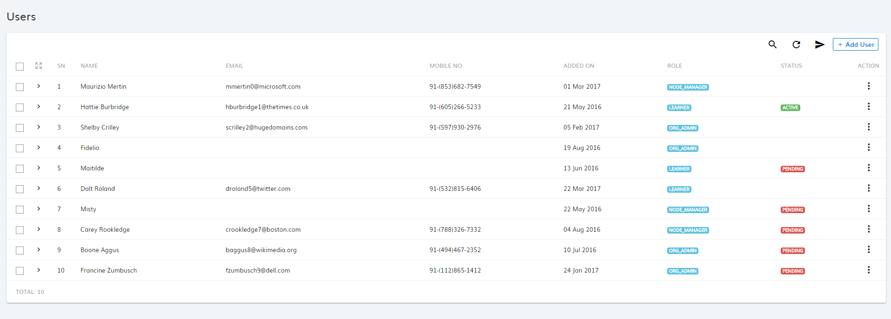
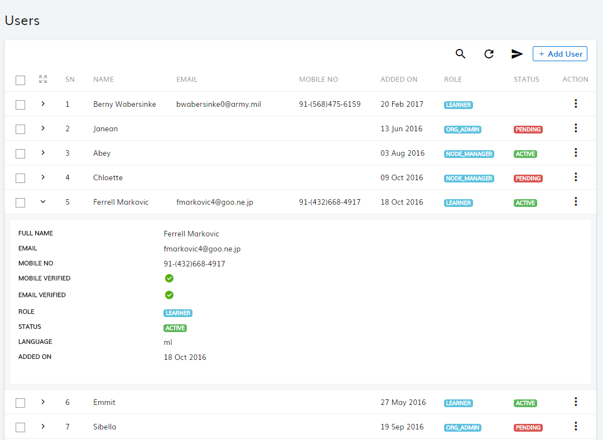
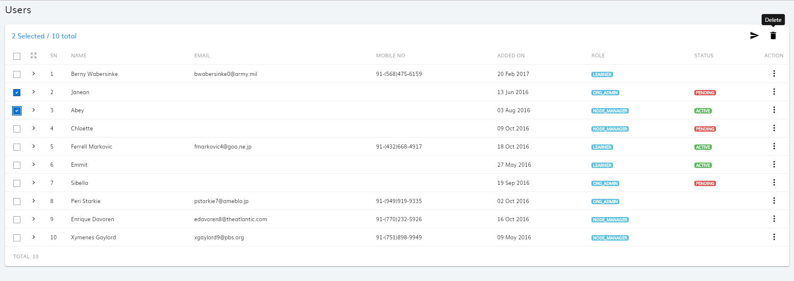
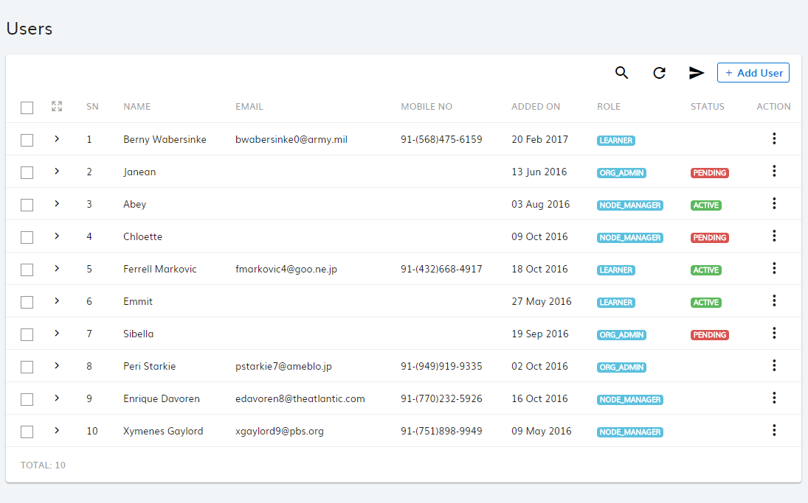
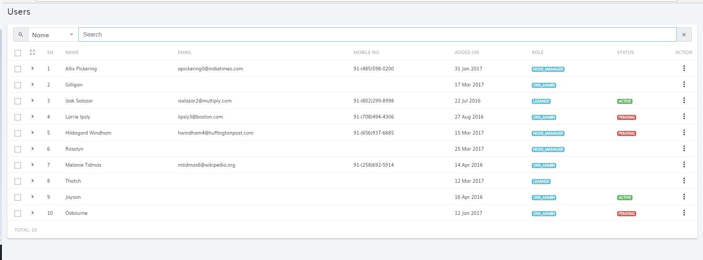
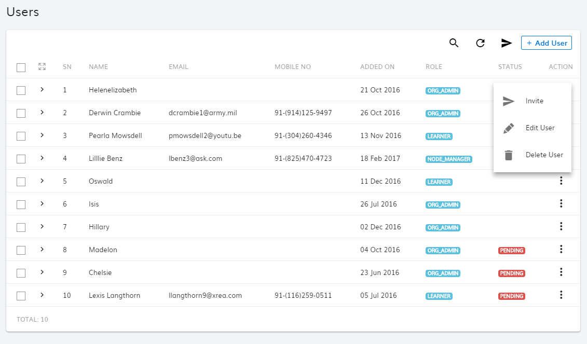
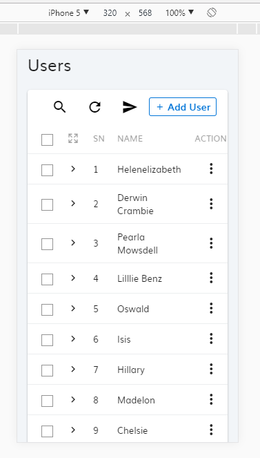

# ng-datatable-x

`ng-datatable-x` is an Angular component for presenting Datatable.
It was built for modern browsers using _TypeScript, CSS3 and HTML5_ and Angular `>=4.0.0`.

See the [changelog](https://github.com/linkstreet/ng-datatable-x/blob/master/CHANGELOG.md) for recent changes.
### Screenshots








### Demo
Coming Soon

### Installation

The latest release of ng-datatable-x can be installed from npm

`npm install @linkstreet/ng-datatable-x`

### Getting started

After Installing, include `NgDatatableX` in your application module like:
```
import { NgModule } from '@angular/core';
import { BrowserModule } from '@angular/platform-browser';
import { NgDatatableX } from 'ng-datatable-x';

import { AppComponent } from './app.component';

@NgModule({
  declarations: [AppComponent],
  imports: [NgDatatableX, BrowserModule],
  bootstrap: [AppComponent]
})
export class AppModule { }
```
then in your app.component.ts you define a table like:
```
import { Component } from '@angular/core';
import { NgbModal } from '@ng-bootstrap/ng-bootstrap';
import { DataTableX } from 'ng-datatable-x';

@Component({
  selector: 'app',
  templateUrl: './app.component.html'
})
export class AppComponent {
    @ViewChild('dataTable') dt: DataTableX;
    columns: any = [
        {name: 'Name', sortable: true, class: 'pl-3', searchable: true, searchKey: 'name'},
        {name: 'Email', sortable: true, class: 'hidden-md-down', searchable: true, searchKey: 'email'},
        {name: 'Mobile No', sortable: true, class: 'hidden-md-down'},
        {name: 'Added On', sortable: true, class: 'hidden-md-down'},
        {name: 'Role', sortable: true, class: 'hidden-xs-down'},
        {name: 'Status', sortable: true, class: 'hidden-xs-down'},
        {name: 'Action', sortable: false, class: 'w75 text-center'}
    ];
    dataTableConfig: any = {
        columns: this.columns,
        route: 'http://api-url-xxx.xx/users', // Send query params page and limit with http get request
        emptyMessage: '<h5>No users available</h5><p>Please add a new user</p>',
        navbarVisible: true,
        headerVisible: true,
        search: true,
        selectable: true,
        expandable: true,
        serialNumber: 'collapse',
        httpHeaders: ''
    };
}
```
then in your app.component.html you define html like:
```
 <div class="card">
      <ng-datatable-x #dataTable [config]="dataTableConfig">
            <ng-template #rowGroups let-row>
                    <td [attr.class]="columns[0].class">
                        {{row.first_name}} {{row.last_name}}
                    </td>
                    <td [attr.class]="columns[1].class">
                        {{row.email}}
                    </td>
        </ng-template>
        <ng-template #rowDetails let-row>
            <dl class="row">
                <dt class="col-sm-3">Full Name</dt>
                <dd class="col-sm-9">{{row.first_name}} {{row.last_name}}</dd>
                <dt class="col-sm-3">Email</dt>
                <dd class="col-sm-9">{{row.email}}</dd>
                <dt class="col-sm-3">Created At</dt>
                <dd class="col-sm-9">{{row.created_at | date: 'dd MM y'}}</dd>
            </dl>
        </ng-template>
        
      </ngx-datatable>
    </div>
```


## Features
- Toolbar
- Global Search with specific columns
- Refresh Table Data
- Show/Hide columns on responsive view
- Server side Pagination & Sorting
- Cell & Row Selection ( Single, Multi, Checkbox )
- Row Detail View (Expand Row option)
- Uses ng-bootstrap and material2 for UI components
- AoT Compilation Support

#### Configurable Parameters

| Config           | Description                                                  |      
|------------------|--------------------------------------------------------|
| columns          |  Set of coulmn object array. In coulmn object you can specify name, sortable - true or false, class, searchable: true or false, searchKey.               |
| route            |  Rest Api end point from which you will receive the josn payload                                                      | 
| emptyMessage     |  Message to display when there is no records available                                                      |
| navbarVisible    |  Show and Hide Table Navbar/Toolbar. In this tool bar you have globar search, refresh data and custom button actions that you can pass using ng-template.                                                      |
| headerVisible    |  Table column header show/hide                                                      |
| search           | Global search functionality show/hide                                                    |
| selectable       | Tables rows selectable using checkbox. Default value is false       |
| expandable       | Tables rows expandable. Default value is false                                    |
| serialNumber     | Serial Number column. You can hide this column by passing css class like- collapse, hidden-md-down to hide in responsive.                                                        |
| httpHeaders      | Pass Http header information your api needs authorization.                                     |

## Columns Object Uses
   ```
   {
       name: 'Column Title', // Specify table column header title/name, you can pass custom html as well for info icon or anything. 
       sortable: true, // To make column sortable.
       class: 'w100',  // To provide column classes. You can use this parementer for multiple use cases. To hide column use `collapse` class. To hide columns in responsive view use bootstrap responsive uitlities classess. To fix width use class like w50, w100, w200 etc or you cana create your own class and pass to set width for a column.
       searchable: true,  // To enable search by this column field in Datatable.
       searchKey: 'name' // I =f searchable is true then this searchKey will be used to filter data via query string alsong with search value.
   }
   ```
   
 ## Methods
 
 ## refresh()
 
 To use this method call this using `this.dt.refresh()` to mannulay refresh the data after adding/ modifying or deleting records from datatable. You can specify page number to navigate to any page like `this.dt.page = 1; this.dt.refresh();`
 
 
## Your Get API Request:
API Endpoint: http://domain.com/endpoint
Query Params: page and limit

## Your Get API Response:
```
    list: [
        {name:'xyz', email: 'xyz@pqr.com'},
        {name:'xyz', email: 'xyz@pqr.com'},
        {name:'xyz', email: 'xyz@pqr.com'}
    ],
    pagination: {
        total: 8, 
        per_page: 15, 
        count: 8, 
        current_page: 1
    }
 ```
